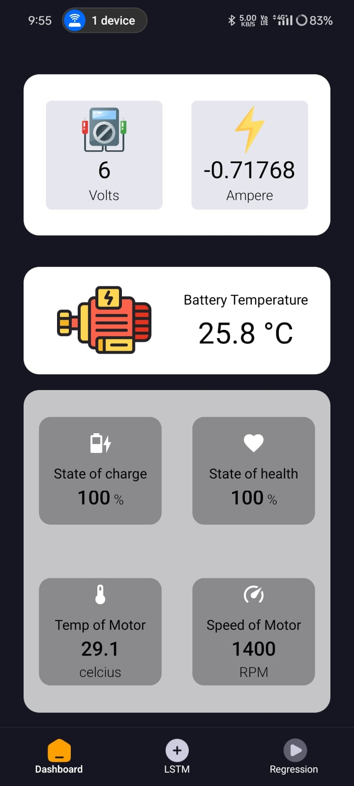
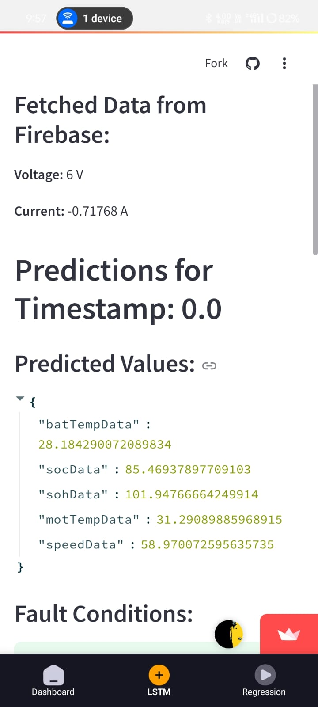
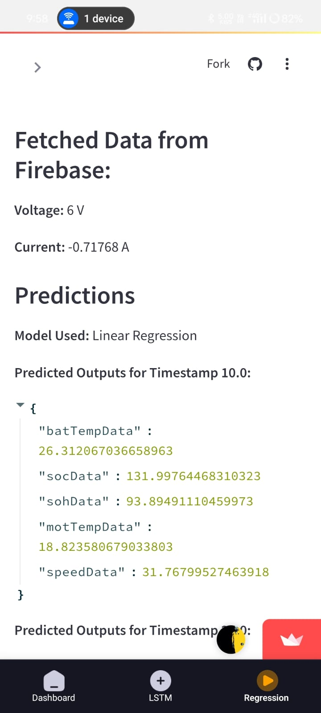

## IOT Based Mobile application

This is a mobile application used to moniter and report the values taken from hardware setup.

### Screen preview

#### Page 1 (Parameters)

#### Screen 2 (LSTM Model)

#### Screen 3 (Regression Model)

